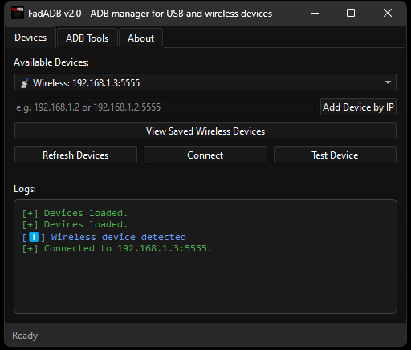
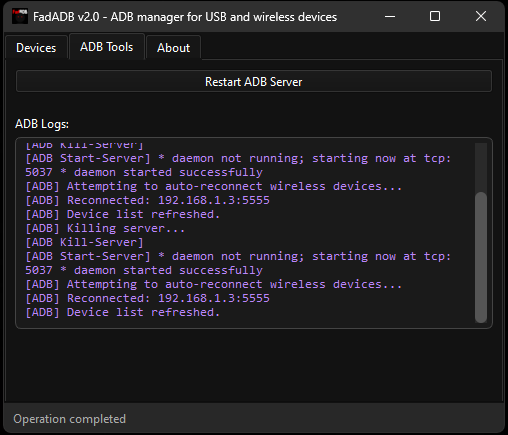
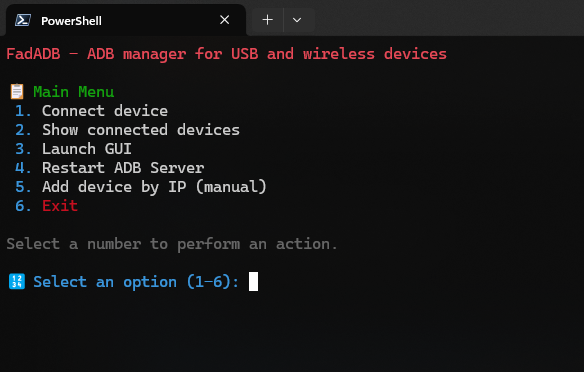

<div align="center">
  


# **FadADB - ADB Manager for USB and Wireless Devices**
</div>

<div align="center">
FadADB is a modern, user-friendly tool for managing Android devices over ADB, supporting both USB and wireless connections. It features a CLI and a beautiful cross-platform GUI, making it easy to connect, manage, and troubleshoot your Android devices for development, debugging, and automation.

<br>

[](https://github.com/anonfaded/FadADB/releases/)

[](https://ko-fi.com/D1D510FNSV)
[](https://discord.gg/kvAZvdkuuN )


<br>

| :exclamation: | This project is part of the [FadSec Lab suite](https://github.com/fadsec-lab). <br> Discover our focus on ad-free, privacy-first applications and stay updated on future releases!  |
|---------------|:---------------------------------------------------------------------------------------------------------------------------------------------------------------|

</div>

<p align="center">
        
</p>


---

## Screenshots

**FadADB comes in both a modern GUI and a fast CLI version:**


*FadADB GUI: Manage, connect, and test Android devices with a modern interface.*


*FadADB GUI: ADB options.*


*FadADB CLI: Fast, clear, and color-coded device management from the terminal.*

---

## Features

- **Connect to Android devices via USB or WiFi (wireless ADB)**
- **Automatic detection and wireless connection**: Plug in via USB, enable wireless debugging, and FadADB will auto-connect wirelessly and remember your device
- **Manual add by IP**: Add and connect to devices by IP address (no USB needed if you know the IP)
- **Auto-reconnect**: Remembers wireless devices and reconnects after ADB server restarts
- **Device list and status**: See all connected devices, with clear USB/WiFi icons
- **Test device**: Instantly check if a device is reachable and responsive
- **ADB server management**: Restart the ADB server from the GUI or CLI
- **View and manage saved wireless devices**
- **Update checker**: Automatically check for new versions with one click
- **Cross-platform**: Works on Windows and Linux

---

## Installation

[](https://github.com/anonfaded/FadADB/releases)

### Windows (Recommended)

- Download the latest installer from the [Releases](https://github.com/anonfaded/FadADB/releases/) page.
- Run the installer and follow the prompts.
- Launch FadADB from the Start Menu or Desktop shortcut.

### From Source (Windows/Linux)

1. Install Python 3.11+ (or newer)
2. Install requirements:

   ```sh
   pip install -r requirements.txt
   # or manually:
   pip install pyqt6 colorama
   ```

3. Run:

   ```sh
   python FadADB.py
   ```

---

## Usage

### CLI
Run:
```sh
python FadADB.py
```
Or launch the `FadADB.exe` if using the packaged version.

**Main Menu Options:**
1. Connect device
2. Show connected devices
3. Launch GUI
4. Restart ADB Server
5. Add device by IP (manual)
6. Exit

### GUI
- Launch from the CLI menu or directly run `FadADB.exe` (or `python FadADB.py --gui`)
- Features:
  - Device list with connect/test/refresh
  - Add device by IP (with example placeholder)
  - View saved wireless devices (shows the path and JSON content)
  - Restart ADB server from the GUI
  - All logs and actions are shown in the interface

---

## How Wireless ADB Works
- Plug in your device via USB and enable wireless debugging in developer options
- FadADB will detect the device, fetch its IP, and connect wirelessly
- Once connected, you can unplug USB and manage the device wirelessly
- FadADB remembers your device's IP for future auto-reconnects
- You can also manually add a device by IP if you know it

**Note:** If your device's IP changes or wireless debugging is disabled, you may need to reconnect via USB to re-enable wireless ADB.

---

## State File
- FadADB stores known wireless device IPs in `fadadb_state.json` (created next to the exe or script)
- You can view and manage this file from the GUI
- This file is ignored by git and not bundled in the installer

---

## Building

### PyInstaller
- Build a standalone exe with:
  ```sh
  pyinstaller FadADB.spec
  ```
- The output will be in `dist/FadADB/`
- The spec file includes all necessary dependencies for features like the update checker

---

## Command Line Shortcut

- You can run `fadadb` command from any terminal to launch the GUI.

---

## Requirements
- Python 3.11+
- PyQt6
- colorama
- adb (Android Debug Bridge) must be in your PATH

---

## Join Community
Join our [Discord server](https://discord.gg/kvAZvdkuuN) to share ideas, seek help, or connect with other users. Your feedback and contributions are welcome!

[](https://discord.gg/kvAZvdkuuN )


## Support

<a href='https://ko-fi.com/D1D510FNSV' target='_blank'></a>

---

## Contributions
Pull requests and suggestions are welcome!
